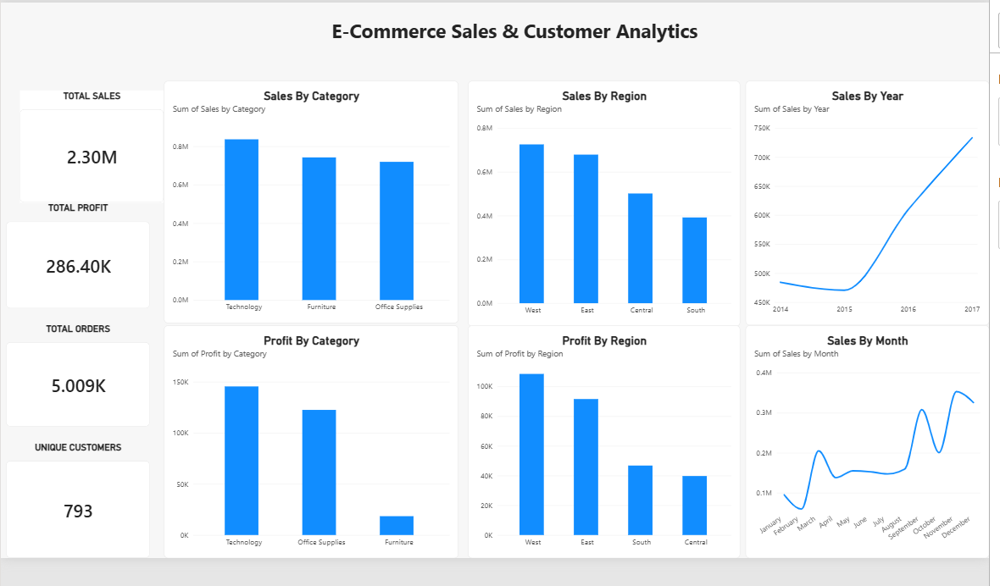
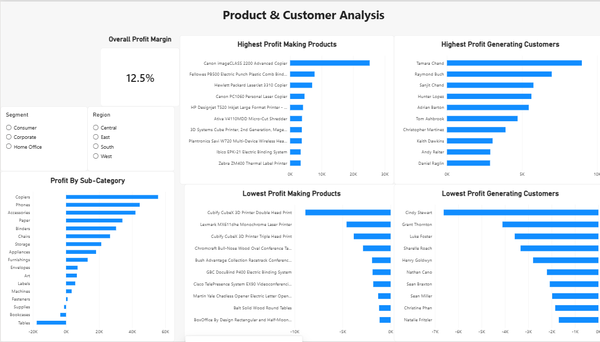
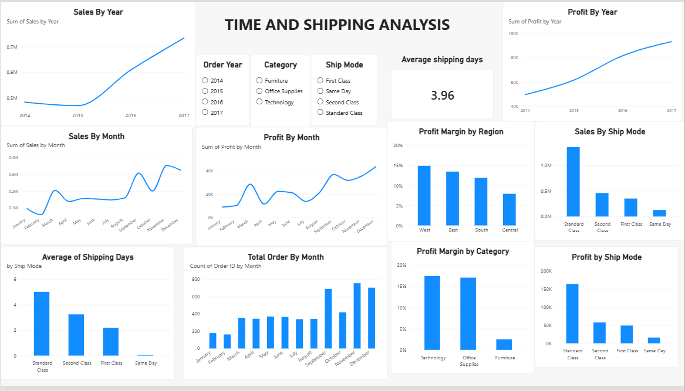

# E-Commerce Sales & Customer Analytics
## Business Problem
The company wants to analyze e-commerce sales data to understand sales performance, profitability, customer behavior, product performance, regional trends, and shipping efficiency. The objective is to identify important business trends and opportunities that can help improve revenue, profitability, and operational efficiency.

## Dataset
The project uses the Sample Superstore dataset, which contains 9,994 records and 21 columns covering orders, customers, products, sales, discounts, profits, regions, and shipping information.

## Tools & Technologies

- Python
- Pandas
- Jupyter Notebook
- Power BI
- SQL
- Git & GitHub

## Project Workflow

1. Data collection and extraction
2. Data cleaning and preprocessing using Python and Pandas
3. Exploratory data analysis
4. KPI and business metric analysis
5. Interactive dashboard development in Power BI
6. Business insights and recommendations

## Dashboard

The Power BI dashboard contains three interactive pages:

- **Executive Overview** — Key performance indicators and high-level sales and profitability analysis.
- **Product & Customer Analysis** — Product, customer, segment, and regional performance analysis.
- **Time & Shipping Analysis** — Sales and profit trends, shipping performance, order trends, and profit-margin analysis.

## Key Metrics

- Total Sales
- Total Profit
- Total Orders
- Unique Customers
- Profit Margin
- Average Shipping Days

## Analysis

The analysis focuses on identifying trends in sales and profitability, comparing product categories and regions, evaluating customer and segment performance, and understanding shipping efficiency.

## Key Insights

- Technology is one of the major contributors to overall sales.
- Profitability varies significantly across product categories.
- Regional performance differs in both sales and profitability.
- Shipping mode affects delivery time and operational efficiency.
- Sales and profit show different patterns over time, highlighting the importance of monitoring both revenue and profitability.

## Recommendations

- Monitor product categories with strong sales but lower profitability.
- Investigate regional differences in sales and profit performance.
- Review shipping modes to identify opportunities for improving delivery efficiency.
- Track sales and profitability trends regularly to support better business decisions.

## Project Structure

ecommerce-analytics/
├── data/        # Dataset files
├── notebooks/   # Python analysis notebooks
├── reports/     # Power BI report files
├── sql/         # SQL queries
├── venv/        # Python virtual environment
└── README.md    # Project documentation

## Dashboard Screenshots

Screenshots of the Power BI dashboard will be added here to showcase the key findings and interactive analysis.

## Dashboard Screenshots

